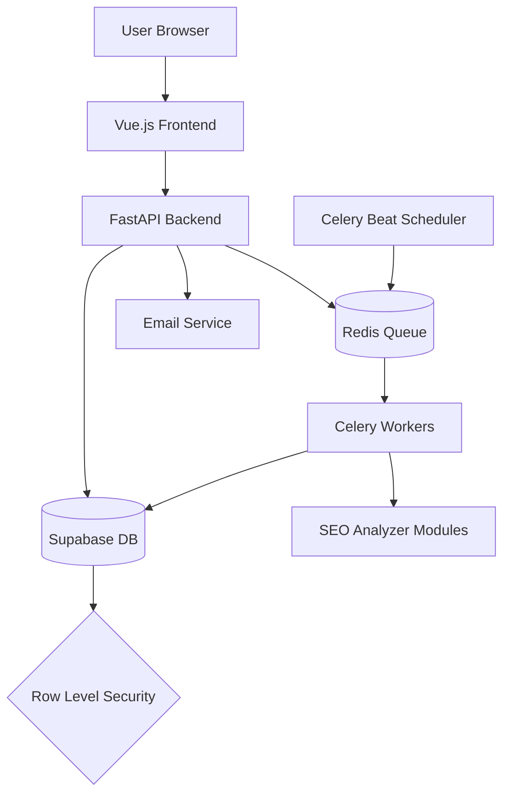

# Design Document

## Overview

This document outlines the technical design for transforming the existing command-line python-seo-analyzer into corewebsitevitals.com, a full-stack SaaS platform. The platform will provide comprehensive SEO analysis through a user-friendly web interface with features including user authentication, asynchronous processing, real-time updates, and historical data tracking.

The design follows a modern microservices architecture with clear separation of concerns between frontend, backend, and worker components. It leverages Vue.js for the frontend, FastAPI for the backend API, Supabase for database management and authentication, and Celery for asynchronous task processing.

## Architecture

The system follows a modern microservices architecture with the following key components:

1. **Frontend Application**: A Vue.js single-page application (SPA) that provides the user interface for registration, login, URL submission, and results visualization.

2. **Backend API**: A FastAPI application that handles authentication, URL validation, task management, and serves as the interface between the frontend and the database.

3. **Database**: Supabase (PostgreSQL) for storing user data, analysis tasks, and results with Row Level Security (RLS) for multi-tenant isolation.

4. **Task Queue**: Redis-backed Celery queue for managing asynchronous analysis tasks.

5. **Worker Processes**: Celery workers that execute the SEO analysis tasks using the existing python-seo-analyzer modules.

6. **Scheduler**: A Celery Beat scheduler for managing recurring analysis tasks.

7. **Email Service**: Resend email delivery service for sending notifications about completed analyses and significant changes.

### System Architecture Diagram

### Data Flow

1. User submits a URL for analysis through the frontend
2. Frontend sends the request to the FastAPI backend
3. Backend validates the request and creates a task record in Supabase
4. Backend enqueues the task in Redis for processing
5. Celery worker picks up the task and executes the SEO analysis
6. Worker updates the task status in real-time through Supabase
7. Frontend receives real-time updates via Supabase subscriptions
8. When analysis completes, results are stored in Supabase
9. Email notifications are sent for scheduled analyses with significant changes

## Components and Interfaces

### Frontend Components

1. **Authentication Module**
   - Login/Register forms
   - JWT token management
   - Session persistence
   - Profile management

2. **Dashboard Module**
   - Overview metrics
   - Analysis history
   - Scheduled analyses management
   - Interactive charts and visualizations

3. **Analysis Module**
   - URL submission form
   - Real-time status tracking
   - Results display with detailed breakdown
   - Historical comparison

4. **Admin Module** (for platform administrators)
   - User management
   - System metrics
   - Configuration settings

### Backend Components

1. **API Layer**
   - Authentication endpoints
   - Analysis management endpoints
   - User management endpoints
   - Scheduled task endpoints

2. **Service Layer**
   - Authentication service
   - Analysis orchestration service
   - Supabase database service
   - SEO analyzer service wrapper

3. **Worker Layer**
   - Task execution
   - Result processing
   - Error handling and retries

4. **Scheduler Layer**
   - Recurring task management
   - Schedule persistence
   - Execution tracking

### External Interfaces

1. **Supabase API**
   - Authentication and user management
   - Database operations
   - Real-time subscriptions

2. **Resend Email Service API**
   - Transactional email delivery using Resend Python SDK
   - HTML email template rendering
   - Delivery tracking and analytics
   - Bounce and complaint handling

3. **SEO Analyzer Modules**
   - Content analysis
   - On-page SEO analysis
   - Technical SEO analysis
   - Scoring and recommendations

## Data Models

### Database Schema

The following tables will be created in Supabase:

1. **profiles** (extends Supabase auth.users)
   - id: UUID (references auth.users.id)
   - email: VARCHAR(255)
   - full_name: VARCHAR(255)
   - avatar_url: VARCHAR(500)
   - subscription_tier: VARCHAR(50)
   - created_at: TIMESTAMP
   - updated_at: TIMESTAMP

2. **analysis_tasks**
   - id: UUID (primary key)
   - user_id: UUID (references auth.users.id)
   - url_analyzed: VARCHAR(2048)
   - status: VARCHAR(50) (PENDING, IN_PROGRESS, SUCCESS, FAILED)
   - celery_task_id: VARCHAR(255)
   - submitted_at: TIMESTAMP
   - started_at: TIMESTAMP
   - completed_at: TIMESTAMP
   - results: JSONB
   - error_message: TEXT
   - analysis_type: VARCHAR(50)

3. **scheduled_analyses**
   - id: UUID (primary key)
   - user_id: UUID (references auth.users.id)
   - url: VARCHAR(2048)
   - frequency: VARCHAR(50) (DAILY, WEEKLY, MONTHLY)
   - next_run: TIMESTAMP
   - last_run: TIMESTAMP
   - is_active: BOOLEAN
   - created_at: TIMESTAMP
   - updated_at: TIMESTAMP

4. **analysis_history**
   - id: UUID (primary key)
   - analysis_task_id: UUID (references analysis_tasks.id)
   - scheduled_analysis_id: UUID (references scheduled_analyses.id, nullable)
   - previous_score: INTEGER
   - current_score: INTEGER
   - score_change: INTEGER
   - notification_sent: BOOLEAN
   - created_at: TIMESTAMP

### Row Level Security Policies

All tables will have Row Level Security (RLS) policies to ensure multi-tenant data isolation:

1. **profiles**
   - Users can only view and update their own profile
   - Admins can view all profiles

2. **analysis_tasks**
   - Users can only view and create their own analysis tasks
   - Tasks are automatically associated with the authenticated user

3. **scheduled_analyses**
   - Users can only view, create, update, and delete their own scheduled analyses
   - Scheduled analyses are automatically associated with the authenticated user

4. **analysis_history**
   - Users can only view history records associated with their own analyses

### API Models (Pydantic Schemas)

1. **Authentication**
   - LoginRequest: email, password
   - RegisterRequest: email, password, full_name
   - TokenResponse: access_token, refresh_token, token_type, expires_in
   - UserProfile: id, email, full_name, avatar_url, subscription_tier, created_at, updated_at

2. **Analysis**
   - AnalysisTaskCreate: url, analysis_type
   - AnalysisTaskResponse: id, user_id, url_analyzed, status, submitted_at, started_at, completed_at, results, error_message, celery_task_id
   - AnalysisResultsResponse: overall_score, issues, recommendations, detailed_results

3. **Scheduled Analysis**
   - ScheduledAnalysisCreate: url, frequency, start_date
   - ScheduledAnalysisResponse: id, user_id, url, frequency, next_run, last_run, is_active, created_at, updated_at

## Error Handling

The system will implement a comprehensive error handling strategy to ensure robustness and provide meaningful feedback to users:

### Frontend Error Handling

1. **API Request Errors**
   - Axios interceptors for global error handling
   - HTTP status code-based error messages
   - Retry logic for transient errors
   - Offline detection and recovery

2. **Form Validation Errors**
   - Client-side validation with immediate feedback
   - Server-side validation error display
   - Field-specific error messages

3. **Authentication Errors**
   - Token expiration handling with automatic refresh
   - Session timeout notifications
   - Unauthorized access redirects

### Backend Error Handling

1. **API Endpoint Errors**
   - Pydantic validation for request data
   - Proper HTTP status codes (400, 401, 403, 404, 500)
   - Structured error responses with error codes and messages
   - Detailed logging for debugging

2. **Database Errors**
   - Connection error handling with retries
   - Transaction management
   - Constraint violation handling
   - Deadlock detection and recovery

3. **Worker Errors**
   - Task retry mechanism with exponential backoff
   - Dead letter queue for failed tasks
   - Error reporting and alerting
   - Timeout handling for long-running tasks

### SEO Analysis Errors

1. **Network Errors**
   - Timeouts for unresponsive websites
   - DNS resolution errors
   - SSL/TLS errors
   - Rate limiting detection

2. **Parsing Errors**
   - Malformed HTML handling
   - Encoding issues
   - Missing content handling
   - JavaScript-rendered content detection

3. **Module-specific Errors**
   - Module initialization errors
   - Analysis execution errors
   - Result formatting errors
   - Resource exhaustion handling

## Testing Strategy

The project will follow a comprehensive testing strategy to ensure quality and reliability:

### Unit Testing

1. **Frontend Unit Tests**
   - Vue component testing with Vue Test Utils
   - Store testing with Pinia test helpers
   - Utility function testing
   - Form validation testing

2. **Backend Unit Tests**
   - Service layer testing
   - Utility function testing
   - Model validation testing
   - Error handling testing

3. **Worker Unit Tests**
   - Task execution testing
   - Error handling testing
   - Retry logic testing
   - Result processing testing

### Integration Testing

1. **API Integration Tests**
   - Endpoint functionality testing
   - Authentication flow testing
   - Error response testing
   - Rate limiting testing

2. **Database Integration Tests**
   - Query performance testing
   - Transaction testing
   - RLS policy testing
   - Constraint testing

3. **Worker Integration Tests**
   - Task queue integration testing
   - Result storage testing
   - Scheduled task testing
   - Error propagation testing

### End-to-End Testing

1. **User Flows**
   - Registration and login flow
   - Analysis submission flow
   - Dashboard interaction flow
   - Scheduled analysis setup flow

2. **Performance Testing**
   - Load testing for API endpoints
   - Stress testing for worker processes
   - Scalability testing
   - Database performance testing

3. **Security Testing**
   - Authentication bypass testing
   - RLS policy bypass testing
   - Input validation testing
   - Rate limiting bypass testing

### Continuous Integration/Continuous Deployment

1. **CI Pipeline**
   - Automated testing on pull requests
   - Code quality checks (linting, type checking)
   - Security vulnerability scanning
   - Test coverage reporting

2. **CD Pipeline**
   - Automated deployment to staging environment
   - Smoke testing after deployment
   - Canary releases for production
   - Rollback capability